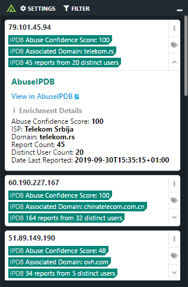

# Polarity AbuseIPDB Integration

The Polarity - AbuseIPDB Integration supports enrichment of IP addresses in ipv4 and ipv6 format.

Check out the integration below:

To learn more about AbuseIPDB, please visit: [official website](https://www.abuseipdb.com)

## AbuseIPDB Integration Options

### API Key
ApiKey needed to access the AbuseIPDB Api.

### Max Age in Days
Max age in days to search AbuseIPDB.

> The max age must be in day format ranging from 1-365.

### Minimum Abuse Confidence Score
Minimum score you want to be notified of from AbuseIPDB.

> The score value must be between 0 and 100.

## Installation Instructions

Installation instructions for integrations are provided on the [PolarityIO GitHub Page](https://polarityio.github.io/).

## Polarity

Polarity is a memory-augmentation platform that improves and accelerates analyst decision making.  For more information about the Polarity platform please see:

https://polarity.io/
